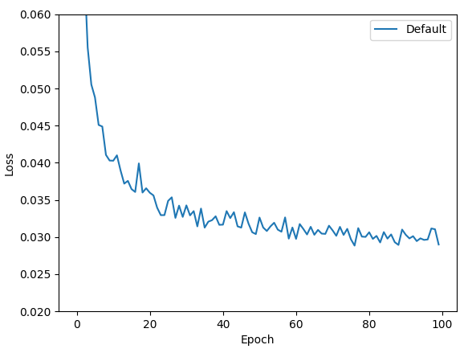
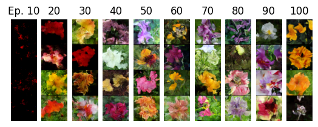
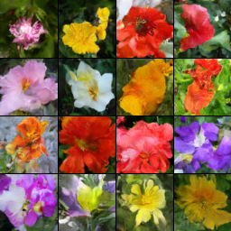
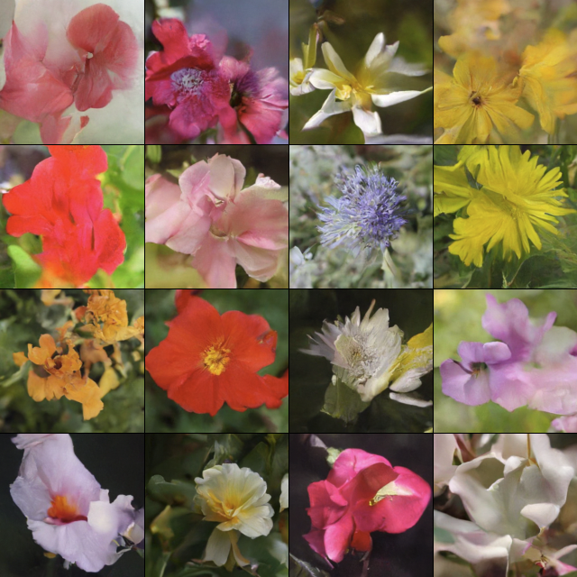

# Diffusion Implementation

This is a simple implementation of DDPM and DDIM, with examples of image diffusion and diffusion policies.

In the future, the diffusion policies will move to a new repo with other imitation learning implementations.

This work is Copyright © 2024 The Johns Hopkins University Applied Physics Laboratory LLC, please see the LICENSE file.

### Image Diffusion

Although this implementation was always targeted towards diffusion policies, I tested some image generation to verify that the diffusion process was working. These experiments use the Oxford flowers dataset.

Settings for the diffusion model can be set in `image_diffusion/config.py`, and train by running `image_diffusion/ddpm.py`.

A few lessons from testing different configurations:

- Convergence is slow, and training can take many hours. Loss is not always a good indicator, as the inference process will use many model passes.
- EMA is very helpful in model convergence.
- I tested the inclusion of attention in the model, with mixed results. I prefer results without attention, but I imagine it is helpful when the dataset is much larger.
- I found little difference between float16 and float32 training.
- Very small models (~1M parameters) degrade into cloudy images. I tended to stay in the 10s of millions of parameters.
- Very small datasets result in memorization and the model cannot generate new content.

#### Results (Smaller Model)

I initially trained a model on a 2080 with 64x64 images for 100 epochs. This resulted in the following:

**Loss curve:**

**Generations every 10 epochs:**

**Final Generations:**

#### Results (Larger Model)

I also tried scaling up to images of size 160x160 with a larger model and trained for 400 epochs on a 4090. This resulted in the following generations:

#### Generation

Once a model is trained you can generate images using `generate.py` and editing the `__main__` portion. There is an option to use DDPM or DDIM.

#### References

I found the following references helpful in building this implementation:

Papers:

- DDPM: https://arxiv.org/abs/2006.11239 (the original work)
- Improved DDPM: https://arxiv.org/pdf/2102.09672.pdf
- Implicit Models (DDIM): https://arxiv.org/pdf/2010.02502.pdf

Codebases:

- https://github.com/huggingface/diffusers/blob/main/examples/unconditional_image_generation/train_unconditional.py

- https://github.com/spmallick/learnopencv/tree/master/Guide-to-training-DDPMs-from-Scratch

- https://github.com/lucidrains/denoising-diffusion-pytorch/blob/main/denoising_diffusion_pytorch/denoising_diffusion_pytorch.py

- https://nn.labml.ai/diffusion/ddpm/unet.html

Videos:

- https://www.youtube.com/watch?v=vu6eKteJWew

### Diffusion Policies

For diffusion policies, we generate a block of N actions rather than image pixels. There are a few important changes:

- The model is generating vectors rather than images, so it uses 1D convolutions
- The diffusion is conditional on states, which requires some architecture changes to inject the current state as an input

The model is then trained to generate N actions based on K previous states. At deployment, up to N actions may be used before generating more, although in practice it is probably better to only use the first few actions that are generated.

#### Environment / Training Data

The environment of choice was a 2D racing simulator in which a car is driving around a track as quickly as possible. States consists of 24 lidar readings spread evenly around the car, as well as the current forward velocity and steering angle (26 state values). The action space is 2 continuous values: acceleration and steering. 100 episodes of a human player using a joystick were collected as the training dataset. See the below video of the environment.

This dynamics of the task make it deceptively difficult. The turning radius of the car is tied to velocity, so turns must be taken at less than full speed to avoid crashing. Crashing (touching the walls) reduces speed instantaneously, and acceleration is slow so this is a significant time penalty- it takes many steps to get back up to speed. Accelerating against the current direction of motion is treated as "breaking", and is much stronger than normal. When no acceleration is applied, the car decelerates on its own until it comes to rest, which can be used as a soft breaking mechanism before turns.

#### Results

Using DDIM, generation is fast enough to get near-real-time behavior. It still pauses slightly to compute new trajectories, but I would say the pause is equivalent to executing the trajectory, so you get a rapid stutter-step phenomenon. Although it looks awkward, it runs at about 40fps on average.

Averaging results over 100 episodes (higher score is better):

Demonstration Performance:

- Average Reward: 58.88 +/- 7.64, Worst Episode: 28.79, Best Episode: 71.15

Diffusion Policy (20 Diffusion Steps):

- Average Reward: 53.77 +/- 13.66, Worst Episode: -33.71*, Best Episode: 66.90

#### Video of Deployed Policy:

https://github.com/ewmstaley/diffusion_experiments/blob/main/assets/policy_video_short_2.mp4

***Notes**:

The trained policy does not understand that the objective of the task is to move in a specific direction. If the car happens to crash and flip around, the policy will simply drive the course backwards, and this results in severe negative results (the worst episodes are sometimes very negative, suggesting driving much more in the wrong direction than the right one).

I think this could be greatly improved with some simple RL augments (for example, learn a value function and then generate N trajectories instead of 1, using the one with the highest estimated value). This would require some sort of reward signal in the demonstrations or during learning.
